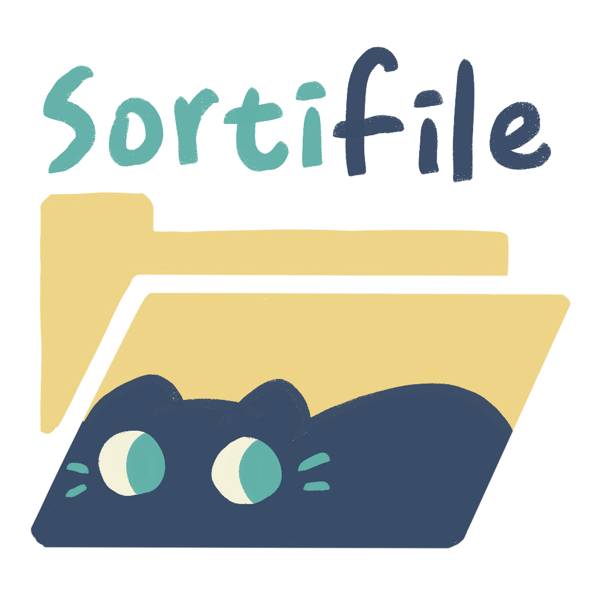

# Sortifile

Sortifile 是一款跨平台的檔案整理工具，透過 AI 輔助使用者自動分類與管理檔案，並提供客製化的整理規則。

## 文件與指南

- HackMD 目錄頁：[Sortifile 文件](https://hackmd.io/@YTP-2024-Mining/sortifile)
- [期中報告投影片](https://docs.google.com/presentation/d/1h2Ih9h0tkLi1BnFowZ6qX1B0yNWUTPq4N31j9LRhu8Q/edit?usp=sharing)
- [期末報告投影片]()(under construction)

## 技術架構

- **前端**：使用 Vue 3 與 Element Plus
- **後端**：使用 Rust 提供高效能的處理
- **整合**：透過 Tauri 進行桌面應用的開發
- **封裝管理**：使用 yarn 作為包管理器

## 功能概述

### 1. **Create Zone**

使用者可以透過 Zone 來設定檔案整理流程，共分為三個步驟：

- **上傳資料夾**：允許使用者選擇並上傳欲整理的檔案夾。
- **問卷設定**：透過問卷收集使用者的偏好，建立三大指標，協助 AI 設定最佳化的整理策略。
- **確認整理規則**：顯示 AI 生成的分類方式，讓使用者進行最後確認與調整。

### 2. **自動分類與整理**

- 根據使用者偏好與 AI 訓練模型，將檔案分類至適當的目錄。
- 支援手動微調與自訂分類規則。
- 可選擇是否進行重複檔案偵測與合併。

## 安裝與執行

### **環境準備**

1. 安裝 [Node.js](https://nodejs.org/)（建議使用 LTS 版本）
2. 安裝 Rust 環境（可參考 [Rust 官方文件](https://www.rust-lang.org/)）
3. 安裝 yarn（若尚未安裝，可使用 `npm install -g yarn`）

### **安裝專案依賴**

```sh
yarn install
```

### **啟動開發模式**

```sh
yarn tauri dev
```

### **打包應用程式**

```sh
yarn tauri build
```

## 貢獻方式

歡迎貢獻程式碼或提出建議，可透過以下方式參與開發：

1. Fork 本專案並建立你的開發分支。
2. 提交 Pull Request，並描述你的修改內容。
3. 如果有任何問題或建議，請開 Issue 進行討論。

## License

本專案採用 MIT License，詳細請參閱 LICENSE 檔案。
